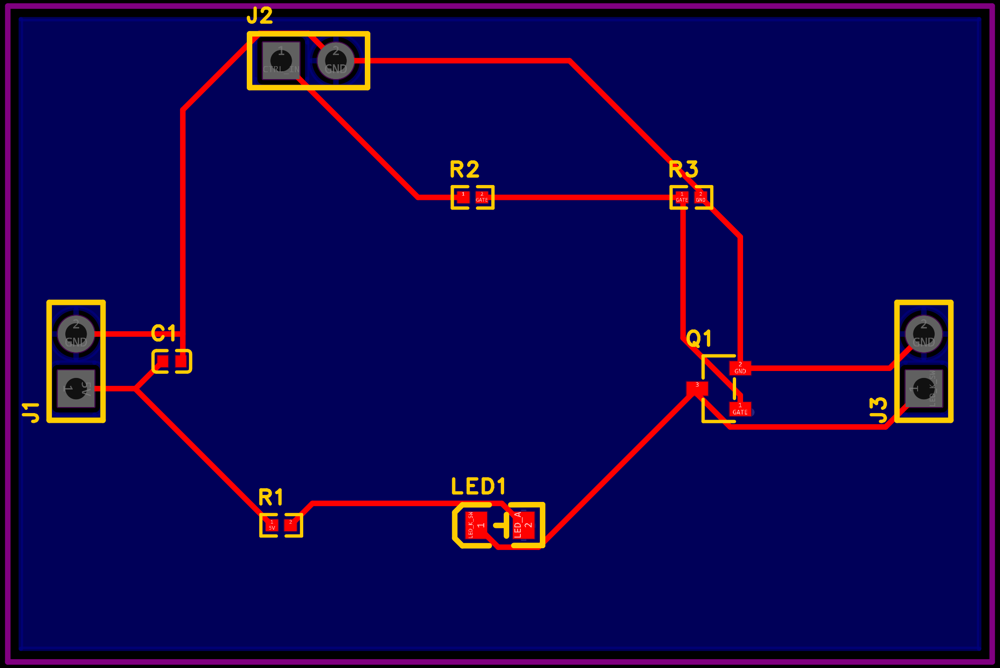

# QuickPCB 5 V MOSFET LED acceptance board

This example is the v0.3.1 end-to-end acceptance project for Quick PCB. It starts from a coordinate-free BoardSpec, creates a native EasyEDA Pro schematic and PCB, reads both documents back through the official Bridge, and includes the files needed to fabricate and assemble the board.



## Circuit

The board switches a low-current green LED with a 2N7002 N-channel MOSFET.

- J1: regulated 5 V input, pin 1 = 5V and pin 2 = GND.
- J2: logic input, pin 1 = CTRL_IN and pin 2 = GND. Use 0 V for off and 3.3 V or 5 V for on.
- J3: switched-node test header, pin 1 = LED_K_SW and pin 2 = GND.
- R1: 2.2 kΩ LED current limiter. Expected current is approximately 1.2–1.5 mA for a green LED.
- R2: 2.2 kΩ gate series resistor.
- R3: 100 kΩ gate pull-down, so the LED stays off with J2 disconnected.
- C1: 100 nF input decoupling capacitor placed beside J1.

The board is a 45.72 mm × 30.48 mm, two-layer acceptance fixture. All traces are 10 mil. The bottom layer contains a locked GND pour. The three headers are through-hole; C1, R1–R3, LED1 and Q1 are top-side SMD parts.

## Files

- `QuickPCB_5V_MOSFET_LED_Demo.yaml`: authoritative BoardSpec.
- `QuickPCB_5V_MOSFET_LED_Demo_v031.eprj2`: saved native EasyEDA Pro project.
- `generated/`: deterministic Protel2 netlists, BOM CSV and Mermaid graph.
- `manufacturing/`: Gerber/drill bundle, EasyEDA BOM and CPL, schematic PDF and PCB PNG.
- `acceptance/verification.json`: dated machine-readable acceptance results.
- `TESTING.md`: bench wiring, expected measurements and pass criteria.
- `verify_example.py`: offline integrity and content verifier.

## Verified state

On 2026-09-25 with EasyEDA Pro 3.2.186 and the official Bridge:

- schematic topology matched 9 components, 6 nets and 19 nodes;
- schematic visible endpoint coverage was 100%, strict schematic DRC had 0 violations, and a repeated plan produced no changes;
- PCB readback matched the same 9 components, 6 nets and 19 nodes;
- all six PCB nets were fully routed, with no component overlap and no component outside the outline;
- MCP strict PCB DRC returned 0 violations;
- EasyEDA's native PCB DRC completed 124 checks with 0 problems;
- the Gerber exporter completed after its own DRC gate and produced copper, mask, silkscreen, outline, PTH drill and flying-probe files.

These checks establish logical consistency and fabrication-file readiness for this design and rule set. A fabricated board has not yet been assembled and powered. Physical pass criteria are therefore provided in `TESTING.md` and remain pending until measurements from real hardware are recorded.

## Verify locally

From the repository root:

```bash
boardspec-core/.venv/bin/python examples/quickpcb-5v-mosfet-led-demo/verify_example.py
```

The verifier performs BoardSpec validation and expansion, checks the native project database, BOM/CPL contents, Gerber member set, generated netlist topology, acceptance metrics and SHA-256 manifest.
